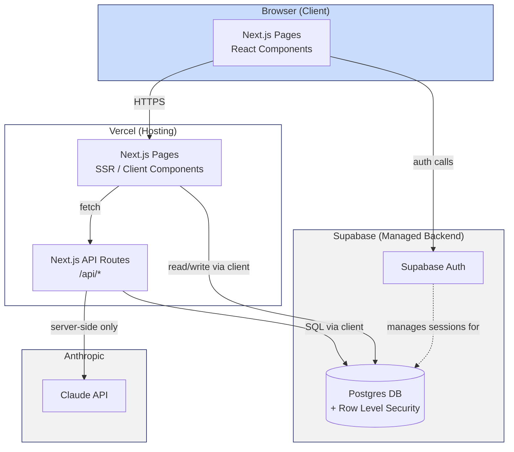
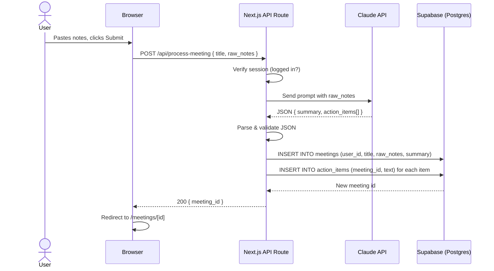
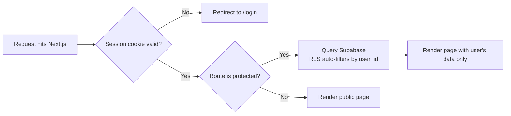

# ActionFlow — System Architecture

Status: Finalized Day 2 — locked for the remainder of the build.

## 1. Overview

ActionFlow is a single Next.js application (frontend + backend API routes in one codebase), backed by Supabase (Postgres + Auth), calling the Claude API server-side, deployed on Vercel.

There is no separate backend server to manage — Next.js API routes *are* the backend.

## 2. Component Diagram

## 3. Data Flow — "Submit Meeting Notes" (core loop)

## 4. Request Lifecycle (every protected page)

## 5. AI Interaction Detail

- The Claude API key lives only in server-side environment variables (`.env.local` locally, Vercel Project Settings in production) — it is **never** sent to or exposed in the browser.
- All Claude calls happen inside Next.js API routes (`app/api/process-meeting/route.ts`), never in client components.
- The prompt requests a **fixed JSON shape**: `{ "summary": string, "action_items": string[] }`. The API route strips any markdown code fences before `JSON.parse()`, and retries once with a stricter instruction if parsing fails.

## 6. External Services

| Service | Purpose | Data sent | Free tier limits to be aware of |
|---|---|---|---|
| Supabase | Database + Auth | User emails, meeting notes, action items | Generous free tier; sufficient for demo-scale usage |
| Anthropic Claude API | Notes → summary + action items | Raw meeting notes text | Pay-as-you-go API credits (not "free" in the same sense — usage-based, low cost for demo volume) |
| Vercel | Hosting + deploy | Application code and build artifacts | Free tier sufficient for a single low-traffic project |
| GitHub | Version control + CI trigger | Source code | Free for public/private repos at this scale |

## 7. Why This Architecture Fits the PRD

- **FR-3/FR-4 (data isolation)** → enforced at the database layer via Supabase Row Level Security, not just application logic — stronger guarantee.
- **FR-6/FR-7 (AI processing + graceful failure)** → isolated inside one API route, easy to add retry/error-handling logic in one place.
- **NFR: Cost** → every layer has a free or low-cost tier; no paid subscriptions required.
