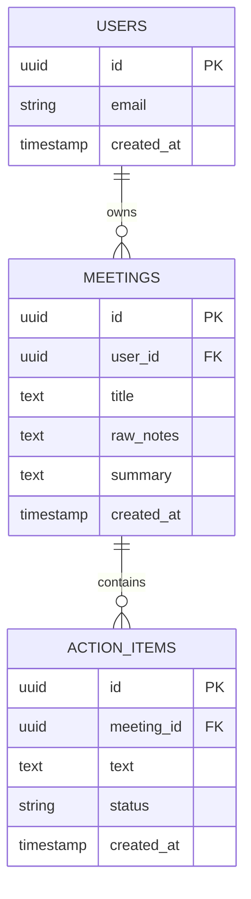

# ActionFlow — Database Schema

Status: Finalized Day 2 — built on Day 3, used unchanged for the rest of the build.

## 1. Entity-Relationship Diagram



`users` is managed automatically by Supabase Auth (`auth.users`) — we do not create or own this table ourselves.

## 2. Table Definitions

### `meetings`

| Column | Type | Constraints | Notes |
|---|---|---|---|
| `id` | `uuid` | PK, default `gen_random_uuid()` | |
| `user_id` | `uuid` | FK → `auth.users.id`, NOT NULL | Owner of the meeting |
| `title` | `text` | NOT NULL, default `'Untitled Meeting'` | User-provided or auto-generated |
| `raw_notes` | `text` | NOT NULL | The original pasted notes |
| `summary` | `text` | NULL until processed | AI-generated summary |
| `created_at` | `timestamptz` | default `now()` | |

### `action_items`

| Column | Type | Constraints | Notes |
|---|---|---|---|
| `id` | `uuid` | PK, default `gen_random_uuid()` | |
| `meeting_id` | `uuid` | FK → `meetings.id`, NOT NULL, `ON DELETE CASCADE` | Deleting a meeting deletes its action items |
| `text` | `text` | NOT NULL | The extracted action item |
| `status` | `text` | NOT NULL, default `'pending'`, CHECK `status IN ('pending','done')` | Toggled by user |
| `created_at` | `timestamptz` | default `now()` | |

## 3. SQL (for Supabase SQL Editor)

```sql
create table meetings (
  id uuid primary key default gen_random_uuid(),
  user_id uuid references auth.users(id) not null,
  title text not null default 'Untitled Meeting',
  raw_notes text not null,
  summary text,
  created_at timestamptz default now()
);

create table action_items (
  id uuid primary key default gen_random_uuid(),
  meeting_id uuid references meetings(id) on delete cascade not null,
  text text not null,
  status text not null default 'pending' check (status in ('pending','done')),
  created_at timestamptz default now()
);

-- Row Level Security
alter table meetings enable row level security;
alter table action_items enable row level security;

create policy "Users can CRUD their own meetings"
  on meetings for all
  using (auth.uid() = user_id)
  with check (auth.uid() = user_id);

create policy "Users can CRUD action items on their own meetings"
  on action_items for all
  using (
    exists (select 1 from meetings where meetings.id = action_items.meeting_id and meetings.user_id = auth.uid())
  )
  with check (
    exists (select 1 from meetings where meetings.id = action_items.meeting_id and meetings.user_id = auth.uid())
  );
```

## 4. Schema Validated Against Every User Story

| User Story | Satisfied by |
|---|---|
| US-1/US-2 (accounts, login) | `auth.users` managed by Supabase Auth |
| US-3/US-4 (submit notes, get summary + items) | `meetings.raw_notes` → `meetings.summary` + rows in `action_items` |
| US-5 (see all past meetings) | `SELECT * FROM meetings WHERE user_id = auth.uid() ORDER BY created_at DESC` |
| US-6 (aggregated action items across meetings) | `SELECT action_items.*, meetings.title FROM action_items JOIN meetings ...` |
| US-7 (mark item complete) | `UPDATE action_items SET status = 'done' WHERE id = ...` (RLS-protected) |
| US-8 (stretch: search) | `ILIKE` query against `meetings.title` / `meetings.raw_notes` |

No unused tables or unnecessary fields — every column maps to a PRD requirement.
