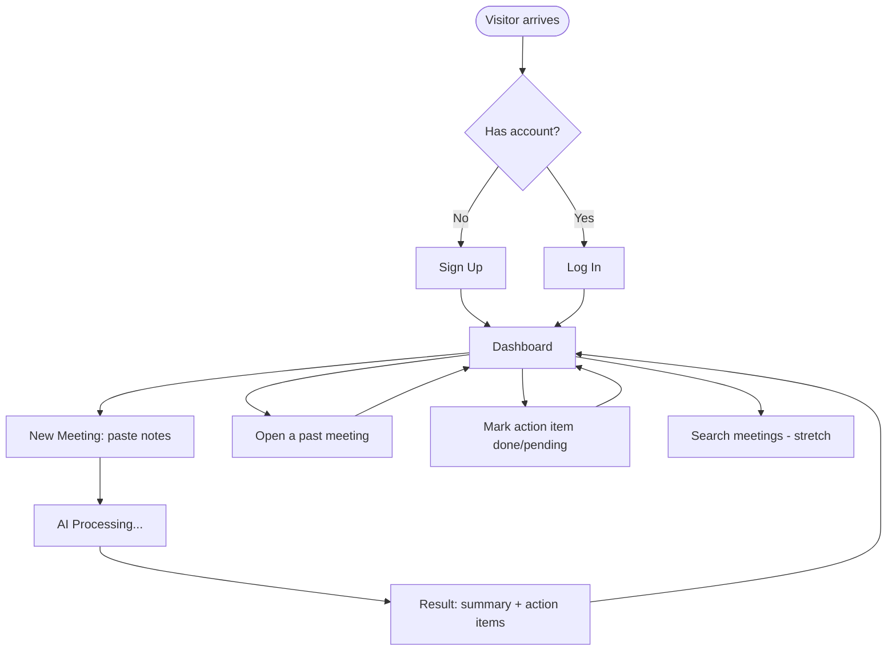

# ActionFlow — UI & User Flow

Status: Finalized Day 2 — every screen below maps directly to a PRD user story. No extra screens.

## 1. User Flow Diagram



## 2. Screen Inventory (every screen exists for a reason)

| Screen | Route | PRD Story it serves |
|---|---|---|
| Sign Up | `/signup` | US-1 |
| Log In | `/login` | US-2 |
| Dashboard | `/dashboard` | US-5, US-6 |
| New Meeting | `/new-meeting` | US-3 |
| Meeting Result / Detail | `/meetings/[id]` | US-4, US-5 |

No account settings, no admin panel, no team pages — intentionally, per PRD out-of-scope list.

## 3. Low-Fidelity Wireframes

### Sign Up / Log In
```
+--------------------------------------+
|              ActionFlow               |
|                                        |
|   Email     [______________________]  |
|   Password  [______________________]  |
|                                        |
|            [   Sign Up   ]            |
|                                        |
|   Already have an account? Log in     |
+--------------------------------------+
```

### Dashboard
```
+----------------------------------------------------+
|  ActionFlow          [ + New Meeting ]  [Log Out]   |
+----------------------------------------------------+
|  Search: [_______________]  (stretch)               |
|------------------------------------------------------|
|  MY MEETINGS                 |  ACTION ITEMS          |
|  - Weekly Sync   (Jul 20)    |  [ ] Send follow-up... |
|  - Client Call   (Jul 18)    |  [x] Update roadmap    |
|  - 1:1 w/ Sam    (Jul 15)    |  [ ] Book venue        |
|                               |  [ ] Review contract   |
+----------------------------------------------------+
```

### New Meeting
```
+--------------------------------------+
|  New Meeting                          |
|                                        |
|  Title   [___________________________]|
|                                        |
|  Notes                                |
|  [                                   ]|
|  [   (large textarea for paste)      ]|
|  [                                   ]|
|                                        |
|            [ Process with AI ]        |
+--------------------------------------+
```

### Meeting Result / Detail
```
+--------------------------------------+
|  Weekly Sync — Jul 20, 2026            |
|                                        |
|  SUMMARY                              |
|  Team aligned on Q3 roadmap...        |
|                                        |
|  ACTION ITEMS                         |
|  [ ] Send follow-up email to client   |
|  [ ] Update roadmap doc               |
|  [x] Book venue for offsite           |
|                                        |
|            [ Back to Dashboard ]      |
+--------------------------------------+
```

## 4. Navigation Rules

- Unauthenticated users are only ever able to reach `/login` and `/signup`.
- After login/signup, the user always lands on `/dashboard`.
- The only way to reach `/new-meeting` or `/meetings/[id]` is from the Dashboard — no deep, disconnected screens.
- Logging out always returns the user to `/login`.
